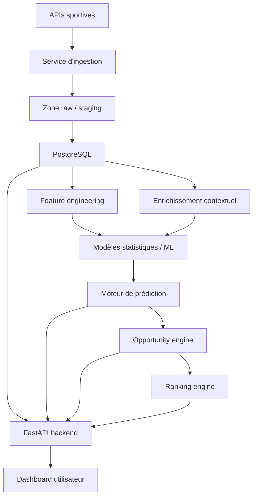

# Architecture système

## Vue d'ensemble

L'architecture recommandée sépare clairement la plateforme en couches pour limiter le couplage et préparer la montée en puissance.



## Couches fonctionnelles

### 1. Ingestion

Responsabilités :

- interroger les API sportives ;
- gérer l'authentification et les quotas ;
- persister les réponses brutes pour audit ;
- transformer les payloads dans un format commun.

Technologie recommandée :

- `Python`
- `httpx` ou `requests`
- tâches planifiées via `cron`, `APScheduler` ou plus tard `Celery`

### 2. Stockage

Responsabilités :

- stocker les données normalisées ;
- garantir l'intégrité relationnelle ;
- permettre les jointures analytiques ;
- conserver l'historique des cotes et prédictions.

Technologie recommandée :

- `PostgreSQL`
- migrations via `Alembic`
- ORM ou couche SQL via `SQLAlchemy`

### 3. Traitement et features

Responsabilités :

- nettoyer les anomalies ;
- gérer les valeurs manquantes ;
- calculer les features métier ;
- produire des datasets prêts à entraîner et inférer.

Exemples de features :

- forme sur les 5 derniers matchs ;
- moyenne de buts marqués / encaissés ;
- Elo avant match ;
- performance domicile / extérieur ;
- dispersion des cotes ;
- repos entre deux matchs ;
- blessures ou suspensions si disponibles.

### 3 bis. Enrichissement contextuel

Responsabilités :

- intégrer les signaux de dernière minute ;
- intégrer les facteurs extra-sportifs structurables ;
- qualifier la fiabilité et la fraîcheur de ces signaux ;
- exposer ces données au moteur de prédiction et au moteur de ranking.

Exemples de signaux :

- blessures et suspensions ;
- lineups probables ou confirmés ;
- densité du calendrier ;
- météo ;
- enjeux de classement ;
- mouvements de cotes.

### 4. Modélisation

Responsabilités :

- entraîner et versionner les modèles ;
- calibrer les probabilités ;
- exposer une interface d'inférence stable ;
- comparer les performances de plusieurs approches.

V1 :

- `Poisson`
- `Elo`
- `régression logistique`

V2 :

- `XGBoost`
- `LightGBM`
- modèles bayésiens
- simulation `Monte Carlo`

### 5. Opportunity engine

Responsabilités :

- convertir les cotes en probabilités implicites ;
- retirer ou mesurer le margin bookmaker ;
- comparer le marché `1X2` vs modèle ;
- appliquer des règles de signal ;
- enregistrer les opportunités détectées.

### 6. Ranking engine

Responsabilités :

- trier toutes les opportunités sur la zone demandée ;
- calculer un score global de deal ;
- pondérer edge, confiance, fraîcheur et qualité des données ;
- retourner une shortlist exploitable par l'utilisateur.

### 7. Backend API

Responsabilités :

- exposer les matchs, cotes, probabilités et signaux ;
- servir le dashboard ;
- offrir des endpoints de backtesting et de performance ;
- sécuriser l'accès aux données.

Technologie recommandée :

- `FastAPI`
- `Pydantic`
- `Uvicorn` / `Gunicorn`

### 8. Dashboard

Responsabilités :

- visualiser les matchs du jour ;
- afficher les probabilités `1X2` du modèle ;
- comparer avec les cotes ;
- suivre l'historique de performance ;
- afficher les alertes et opportunités.

Technologie recommandée :

- V1 : `Streamlit` pour accélérer le démarrage
- V2 : `Next.js` + `TypeScript` + `React`

## Architecture logique cible

```text
Client UI
    -> Backend API
        -> Service lecture données
        -> Service prédiction
        -> Service opportunités
        -> Service ranking
            -> PostgreSQL

Planificateur
    -> Service ingestion
    -> Service normalisation
    -> Service enrichissement contextuel
        -> PostgreSQL
```

## Architecture de déploiement recommandée

### Phase 1

- 1 conteneur `PostgreSQL`
- 1 conteneur `FastAPI`
- 1 conteneur `ingestion worker`
- 1 conteneur `dashboard`

### Phase 2

- `Redis` pour cache et événements live ;
- `ClickHouse` pour analytics massif ;
- service `Rust` dédié au recalcul live ;
- bus d'événements léger si le temps réel devient central.

## Principes techniques

- `Single source of truth` : PostgreSQL reste la source primaire de vérité en V1.
- `Raw first` : conserver la réponse brute de l'API avant transformation.
- `Idempotence` : une ingestion relancée ne doit pas dupliquer les données.
- `Versioning` : versionner schéma, features et modèles.
- `Explainability` : chaque deal remonté doit pouvoir être justifié.
- `Observabilité` : journaliser les erreurs, latences, volumes et taux d'échec.

## Monorepo recommandé

```text
apps/
services/
db/
docs/
infra/
tests/
```

Cette structure permet de démarrer simplement tout en gardant une séparation claire entre produits, services et infrastructure.
