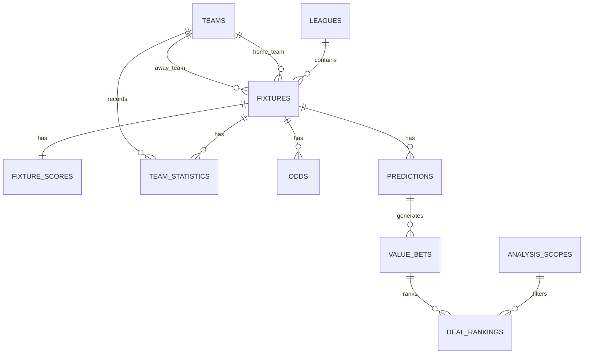

# Modèle de données V1

## Objectif

La base `PostgreSQL` doit couvrir le cycle complet d'une prédiction pré-match :

- football uniquement ;
- définition du périmètre d'analyse utilisateur ;
- référentiel des compétitions et équipes ;
- stockage des matchs ;
- stockage des résultats et statistiques ;
- stockage des cotes ;
- stockage des prédictions ;
- stockage des recommandations ;
- stockage des résultats de backtesting.

## Entités supplémentaires orientées produit

### `analysis_scopes`

Périmètre d'analyse choisi par l'utilisateur.

Champs recommandés :

- `id`
- `name`
- `sport`
- `countries_json`
- `leagues_json`
- `bookmakers_json`
- `markets_json`
- `time_window_start`
- `time_window_end`
- `is_active`
- `created_at`
- `updated_at`

## Entités principales

### `leagues`

Référentiel des compétitions.

Champs recommandés :

- `id`
- `provider`
- `provider_league_id`
- `name`
- `country`
- `season`
- `is_active`
- `created_at`
- `updated_at`

### `teams`

Référentiel des équipes.

Champs recommandés :

- `id`
- `provider`
- `provider_team_id`
- `name`
- `short_name`
- `country`
- `founded_year`
- `logo_url`
- `created_at`
- `updated_at`

### `fixtures`

Table centrale des matchs.

Champs recommandés :

- `id`
- `provider`
- `provider_fixture_id`
- `league_id`
- `season`
- `kickoff_at`
- `status`
- `venue_name`
- `home_team_id`
- `away_team_id`
- `round`
- `created_at`
- `updated_at`

### `fixture_scores`

Scores et résultat consolidé du match.

Champs recommandés :

- `id`
- `fixture_id`
- `home_score_ht`
- `away_score_ht`
- `home_score_ft`
- `away_score_ft`
- `home_score_et`
- `away_score_et`
- `home_score_pen`
- `away_score_pen`
- `result_1x2`
- `total_goals`
- `both_teams_scored`
- `created_at`
- `updated_at`

### `team_statistics`

Statistiques d'équipe par match.

Champs recommandés :

- `id`
- `fixture_id`
- `team_id`
- `is_home`
- `possession_pct`
- `shots_total`
- `shots_on_target`
- `corners`
- `fouls`
- `yellow_cards`
- `red_cards`
- `offsides`
- `passes_total`
- `passes_accuracy_pct`
- `expected_goals`
- `created_at`
- `updated_at`

### `odds`

Historique des cotes par bookmaker, marché et issue.

Champs recommandés :

- `id`
- `fixture_id`
- `bookmaker`
- `market`
- `outcome`
- `line_value`
- `odd`
- `captured_at`
- `is_closing_line`
- `created_at`

Marchés V1 recommandés :

- `1X2`

### `predictions`

Prédictions générées par le moteur.

Champs recommandés :

- `id`
- `fixture_id`
- `model_name`
- `model_version`
- `generated_at`
- `home_win_prob`
- `draw_prob`
- `away_win_prob`
- `expected_home_goals`
- `expected_away_goals`
- `metadata_json`
- `created_at`

### `value_bets`

Signaux issus de la comparaison modèle vs marché.

Champs recommandés :

- `id`
- `fixture_id`
- `prediction_id`
- `bookmaker`
- `market`
- `outcome`
- `line_value`
- `model_probability`
- `implied_probability`
- `edge_pct`
- `fair_odd`
- `market_odd`
- `detected_at`
- `created_at`

### `deal_rankings`

Classement final présenté à l'utilisateur.

Champs recommandés :

- `id`
- `analysis_scope_id`
- `fixture_id`
- `prediction_id`
- `value_bet_id`
- `ranking_score`
- `confidence_score`
- `data_quality_score`
- `urgency_score`
- `rank_position`
- `summary_reason`
- `generated_at`
- `created_at`

### `model_runs`

Traçabilité des entraînements et inférences.

Champs recommandés :

- `id`
- `model_name`
- `model_version`
- `run_type`
- `started_at`
- `finished_at`
- `status`
- `training_window_start`
- `training_window_end`
- `metrics_json`
- `notes`

## Relations clés

## Contraintes recommandées

- unicité sur `(provider, provider_team_id)` dans `teams`
- unicité sur `(provider, provider_league_id, season)` dans `leagues`
- unicité sur `(provider, provider_fixture_id)` dans `fixtures`
- unicité composite sur les snapshots de `odds`
- index sur `kickoff_at`, `league_id`, `fixture_id`, `captured_at`
- clés étrangères systématiques entre entités liées

## Règles de qualité des données

- stocker les dates en `UTC`
- garder les valeurs brutes API lorsqu'une transformation est ambiguë
- ne jamais écraser silencieusement une cote historique
- versionner les prédictions à chaque recalcul
- distinguer clairement données observées et données dérivées

## Évolution future

Le schéma V1 doit pouvoir accueillir plus tard :

- événements live détaillés ;
- lineups ;
- blessures et suspensions ;
- cotes live ;
- features pré-calculées ;
- résultats de simulations massives.
