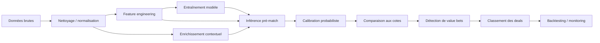

# Pipeline de prédiction

## Objectif

Transformer des données de football historiques et pré-match en probabilités calibrées sur le marché `1X2`, puis en recommandations classées.

## Pipeline logique

## Étape 1. Nettoyage

Actions :

- uniformiser les identifiants équipes / ligues / matchs ;
- corriger les types de données ;
- gérer les valeurs manquantes ;
- filtrer les matchs annulés ou incomplets ;
- aligner les timestamps.

## Étape 2. Feature engineering

Features minimales V1 :

- force offensive domicile ;
- force défensive domicile ;
- force offensive extérieur ;
- force défensive extérieur ;
- Elo avant match ;
- forme récente sur 5 matchs ;
- moyenne de buts marqués ;
- moyenne de buts encaissés ;
- avantage domicile ;
- nombre de jours de repos ;
- probabilités implicites de marché.

## Étape 2 bis. Enrichissement contextuel

Cette couche ajoute les signaux non purement historiques.

Exemples :

- blessures et suspensions ;
- lineups de dernière minute ;
- calendrier chargé ;
- météo ;
- mouvements de cotes ;
- importance compétitive du match.

## Étape 3. Modèles V1

### Modèle Poisson

Usage :

- estimer le nombre de buts attendus par équipe ;
- dériver les probabilités de scores et de marchés simples ;
- solution robuste, interprétable et rapide.

Sorties :

- `expected_home_goals`
- `expected_away_goals`
- probabilité `1X2`

### Modèle Elo

Usage :

- mesurer la force relative de deux équipes ;
- enrichir le Poisson ou servir de baseline séparée ;
- très utile pour suivre la dynamique dans le temps.

### Régression logistique

Usage :

- benchmark simple sur le marché `1X2` ;
- interprétable ;
- efficace si les features sont bien construites.

## Étape 4. Calibration

Les probabilités brutes doivent être calibrées pour éviter des sorties trop confiantes.

Méthodes possibles :

- `Platt scaling`
- `Isotonic regression`
- calibration empirique par buckets

## Étape 5. Détection de value bets

Formules utiles :

- `implied_probability = 1 / odd`
- `fair_odd = 1 / model_probability`
- `edge = model_probability - implied_probability`

Exemple de règle V1 :

- signaler une opportunité si `edge >= 0.05`
- exclure les marchés à faible liquidité
- filtrer les cotes extrêmes ou incohérentes
- limiter la détection au marché `1X2`

## Étape 6. Classement des meilleurs deals

Une opportunité détectée n'est pas automatiquement une bonne recommandation finale. Il faut la classer.

Exemple de score :

- edge estimé ;
- confiance du modèle ;
- fraîcheur de l'information ;
- couverture des données ;
- cohérence du signal sur plusieurs dimensions.

## Étape 7. Backtesting

Le backtesting doit répondre à deux questions :

1. Les probabilités sont-elles justes ?
2. Les signaux détectés auraient-ils été rentables ?

Métriques recommandées :

- `log loss`
- `Brier score`
- `ROI`
- `yield`
- `hit rate`
- `closing line value`

En complément, la V1 doit aussi évaluer la qualité du classement produit.

Métriques utiles :

- rendement du top 5 / top 10 deals ;
- précision des recommandations prioritaires ;
- dispersion entre score de ranking et résultat réel.

## Étape 8. Monitoring

Le système doit suivre :

- dérive de performance du modèle ;
- volume de matchs scorés ;
- distribution des probabilités ;
- fréquence des signaux ;
- performance par ligue, bookmaker et marché.

## Évolution vers le live

Quand le temps réel sera prioritaire :

- ingestion d'événements live ;
- recalcul de l'état de match en continu ;
- service `Rust` pour simulations rapides ;
- cache `Redis` pour les états transitoires ;
- règles temps réel sur cartons, buts, momentum et temps restant.
