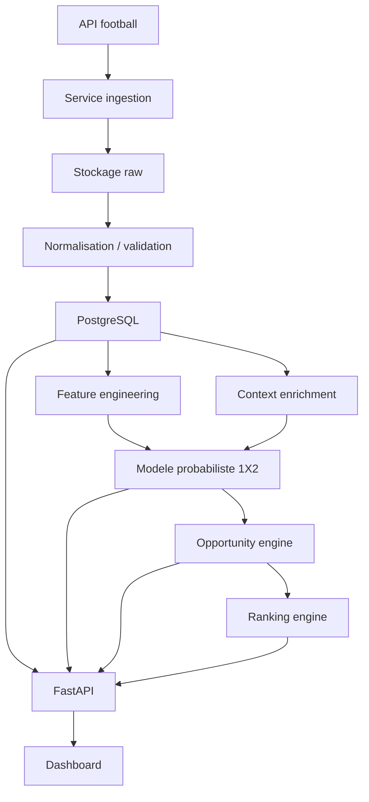

# Architecture solution V1

## 1. Principe

La V1 repose sur une architecture modulaire simple, conçue pour être fiable, explicable et évolutive.

Le système sépare cinq responsabilités majeures :

- acquisition de données ;
- stockage et normalisation ;
- calcul prédictif ;
- classement des opportunités ;
- exposition produit.

## 2. Vue d'ensemble

## 3. Composants V1

### 3.1 Service d'ingestion

Rôle :

- consommer les API football ;
- collecter équipes, ligues, matchs, statistiques et cotes ;
- stocker les payloads bruts ;
- garantir l'idempotence des imports.

### 3.2 Service de normalisation

Rôle :

- transformer les payloads fournisseurs dans un schéma interne stable ;
- nettoyer les incohérences ;
- enrichir les dates, statuts et références ;
- produire des données auditables.

### 3.3 Base de données PostgreSQL

Rôle :

- stocker la vérité métier de la V1 ;
- conserver les historiques de cotes et prédictions ;
- alimenter l'API, le moteur et le backtesting.

### 3.4 Moteur de features

Rôle :

- calculer les indicateurs utiles au modèle ;
- générer des variables reproductibles ;
- préparer les vues d'entraînement et d'inférence.

### 3.5 Moteur de prédiction

Rôle :

- calculer les probabilités `home/draw/away` ;
- gérer le versionnement des modèles ;
- publier les résultats vers la base.

### 3.6 Opportunity engine

Rôle :

- convertir les cotes en probabilités implicites ;
- comparer modèle et marché ;
- détecter les écarts exploitables.

### 3.7 Ranking engine

Rôle :

- transformer les écarts détectés en liste priorisée ;
- produire un score global de deal ;
- ordonner les opportunités pour l'utilisateur.

### 3.8 Backend FastAPI

Rôle :

- exposer les données au dashboard ;
- servir les résultats de ranking ;
- proposer des endpoints propres pour les analyses et historiques.

### 3.9 Dashboard

Rôle :

- rendre le système visible et démontrable ;
- afficher les matchs, cotes, probabilités et signaux ;
- offrir un point d'accès simple aux utilisateurs non techniques.

## 4. Choix technologiques V1

### Langage principal

- `Python`

Justification :

- excellent pour ingestion et data ;
- riche écosystème ML/statistiques ;
- rapidité de développement ;
- forte lisibilité pour un prototype sérieux.

### Base de données

- `PostgreSQL`

Justification :

- robuste ;
- suffisante pour la V1 ;
- adaptée aux jointures analytiques ;
- excellente base pour démarrer avant une spécialisation future.

### Backend

- `FastAPI`

Justification :

- rapide à développer ;
- très bon support des schémas ;
- bonne performance ;
- excellente DX pour API produit.

### Frontend

- `Streamlit` au démarrage ou `Next.js` si l'on veut tout de suite une vitrine plus premium.

Recommandation :

- démarrer avec `FastAPI + Streamlit` si priorité à la vitesse d'exécution ;
- basculer ou compléter avec `Next.js` si priorité à la qualité de présentation commerciale.

## 5. Flux applicatifs

### Flux 1. Ingestion

1. interrogation de l'API football
2. stockage de la réponse brute
3. validation et mapping
4. insertion / mise à jour dans PostgreSQL

### Flux 2. Calcul de prédiction

1. lecture des matchs à analyser
2. calcul des features
3. calcul des probabilités `1X2`
4. stockage dans `predictions`

### Flux 3. Détection et ranking

1. lecture des cotes `1X2`
2. calcul des probabilités implicites
3. mesure des écarts
4. création des `value_bets`
5. scoring global
6. production du `ranking`

### Flux 4. Consultation utilisateur

1. sélection d'une zone
2. chargement des matchs concernés
3. affichage des deals classés
4. consultation des détails par match

## 6. Principes d'architecture

- `raw first`
- `single source of truth`
- `idempotent ingestion`
- `model versioning`
- `traceable predictions`
- `explainable ranking`

## 7. Architecture cible de vente

Pour une présentation commerciale, la plateforme doit être décrite comme un socle évolutif en trois étages :

- `Data Platform` : collecte, qualité et historisation
- `Decision Engine` : probabilités, détection et ranking
- `Product Layer` : API, dashboard, reporting et futur abonnement

Cette formulation est plus forte commercialement qu'une simple description technique.
